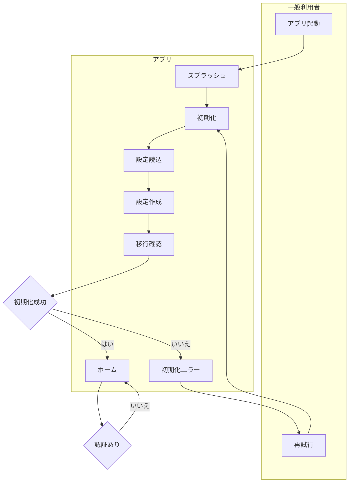
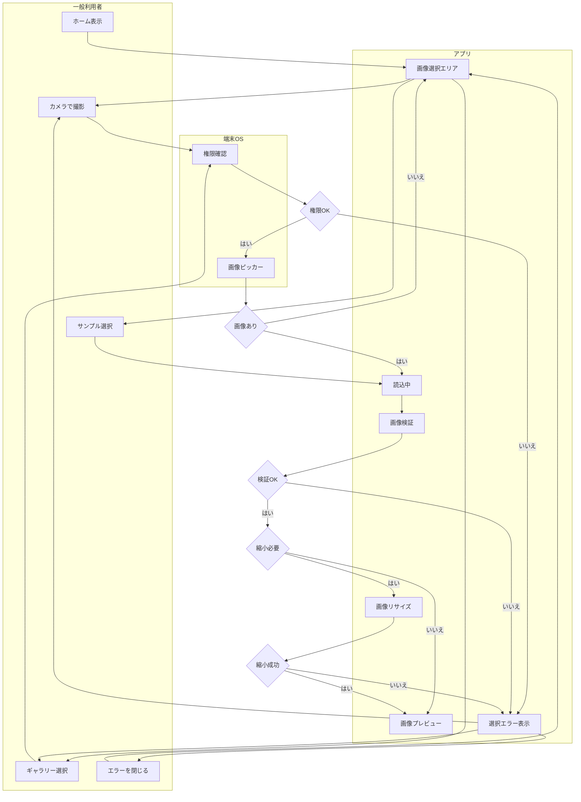
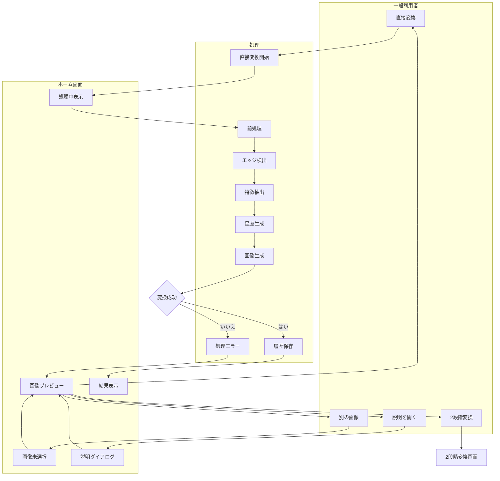
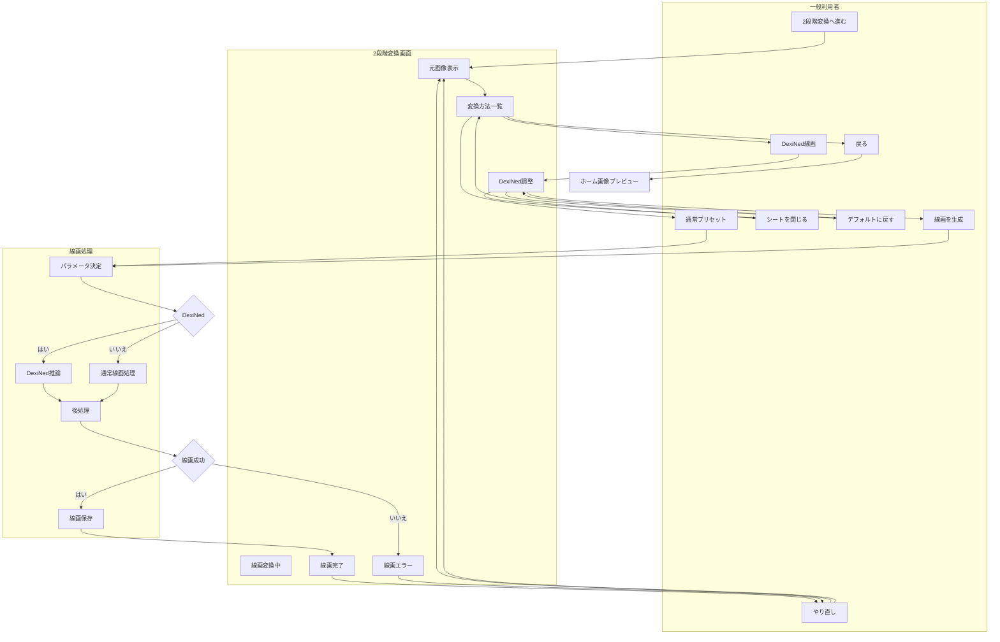
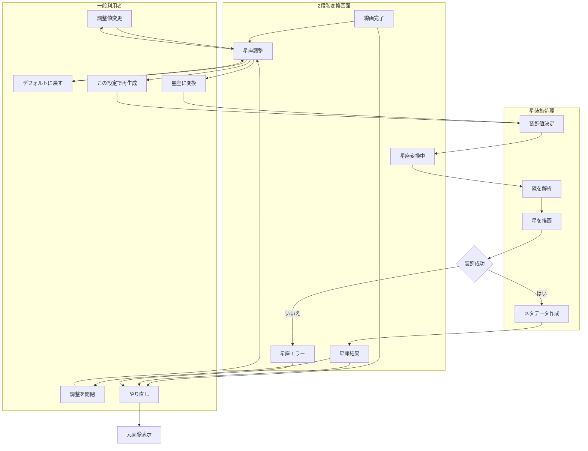
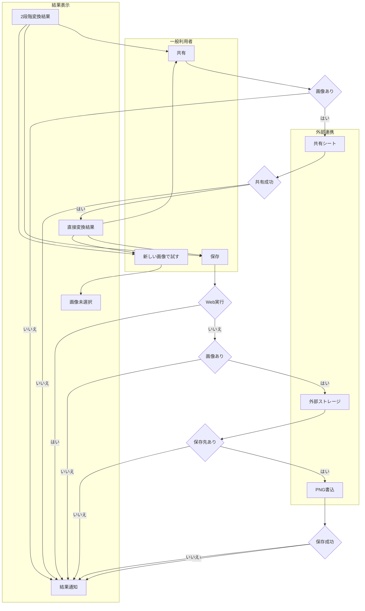
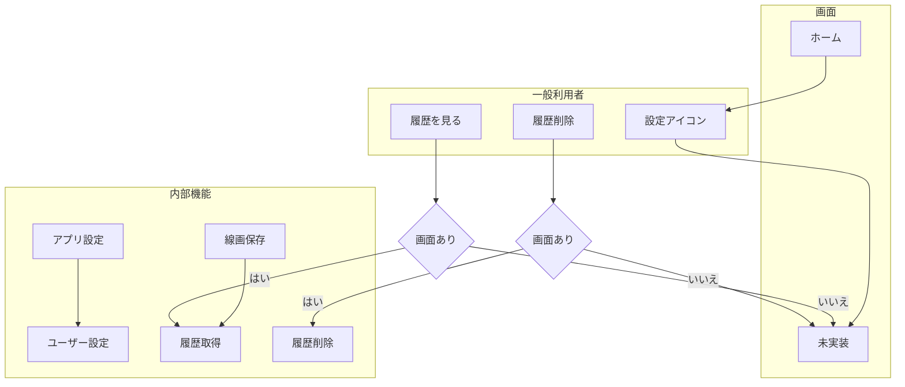
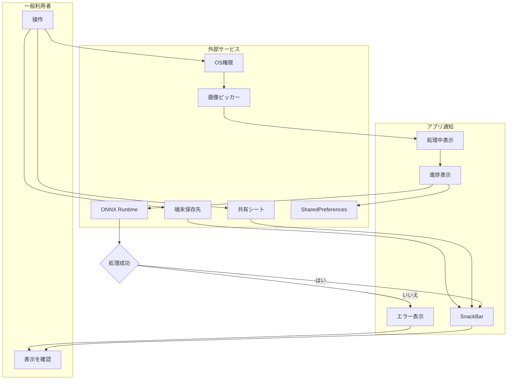
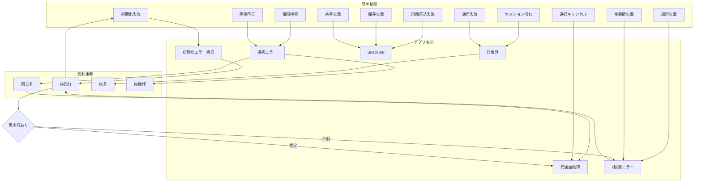

# user_flow_diagrams.md
- 最終更新日: 2026-05-01
- バージョン: 1.0

## 目的
この文書は、`seizani_app` の仕様と実装から読み取れるユーザー操作、画面遷移、状態遷移、権限分岐、入力バリデーション、エラー処理を、レビュー可能なMermaidフロー図として整理する。

## 1. 抽出した前提情報

### ユーザーロール
- 一般利用者: 画像を選び、星座アートへ変換し、保存または共有するユーザー。
- 管理者、ログインユーザー、課金ユーザー: 仕様および実装からは読み取れない。
- システム側アクター: 端末OS権限、画像ピッカー、共有シート、ローカルストレージ、ONNX Runtime。

### 機能カテゴリ
- 起動、初期化
- 画像選択
- 直接変換
- 2段階変換
- DexiNed線画調整
- 星座装飾調整
- 結果表示、保存、共有
- ローカル保存、履歴、設定の内部処理
- 権限、バリデーション、エラー処理

### 画面一覧
- スプラッシュ画面
- 初期化エラー画面
- ホーム画面
- 画像選択エリア
- 変換方法説明ダイアログ
- 2段階変換画面
- DexiNed線画調整ボトムシート
- 星座変換調整パネル
- 2段階変換エラー表示
- 結果表示エリア
- 設定画面: アイコンのみ存在。遷移は未実装。

### 主な操作
- カメラで撮影
- ギャラリーから選択
- 検証用サンプルを選択
- エラーを閉じる
- 別の画像を選ぶ
- 直接変換
- 2段階変換へ進む
- 変換方法説明を開く、閉じる
- 線画プリセットを選ぶ
- DexiNed調整値を変更する
- DexiNed調整をデフォルトに戻す
- DexiNed線画を生成する
- 2段階変換画面から戻る
- 線画変換をやり直す
- 星座に変換する
- 星座装飾パラメータを変更する
- この設定で再生成する
- 結果を共有する
- 結果を保存する
- 新しい画像で試す

### 主な分岐条件
- 初期化成功か失敗か
- 画像が未選択、選択済み、結果生成済みか
- カメラまたは写真ライブラリ権限が許可されたか
- 画像選択がキャンセルされたか
- 画像がバリデーションを満たすか
- 画像が大きくリサイズ対象か
- 直接変換か2段階変換か
- 線画プリセットがDexiNedかそれ以外か
- 線画変換が成功したか失敗したか
- 星座装飾が成功したか失敗したか
- 結果画像データが存在するか
- Web実行かネイティブ実行か
- 外部ストレージへアクセスできるか

### バリデーション
- 対応形式: JPEG、PNG、WebP、BMP、GIF。
- 最小画像サイズ: 100x100px。
- 最大画像サイズ: 4000x4000px。
- 最大ファイルサイズ: 50MB。
- 許容アスペクト比: 0.1 から 10.0。
- 処理前リサイズ: 1200x1200pxを超える画像は縮小。
- DexiNed調整: 線の量 85.0 から 98.0、ノイズ抑制 0 から 80、線の太さ 1 から 3。
- 星座装飾調整: 線の太さ閾値 0.5 から 8.0、星密度 0.2 から 2.0、星サイズ最小 0.5 から 6.0、星サイズ最大 0.5 から 8.0、明るさ 0 から 1、グロー 0 から 1。

### 想定補完した内容
- 認証機能は存在しないため、認証フローは「なし」として扱う。
- 初回利用フローは、初期化時のローカル設定とユーザー設定の作成、および初回画像選択として扱う。
- 通知フローはPush通知ではなく、進捗表示、SnackBar、エラー表示として扱う。
- 外部連携は、端末OS権限、画像ピッカー、共有シート、ローカルストレージ、ONNX Runtimeを対象にする。
- 通信エラーは通常アプリ操作では登場しない。DexiNedモデル取得スクリプトは開発、セットアップ用途であり、アプリ内ユーザーフロー外とする。

### 不明点
- 設定画面の仕様は未実装。
- 履歴一覧、詳細、削除のUIは未実装。ただしProviderとUseCaseには履歴取得、削除、全削除が存在する。
- 処理中キャンセルUIは見当たらない。
- ログイン、セッション切れ、管理者権限、決済、Push通知は仕様から読み取れない。
- 直接変換の失敗時にホーム画面へエラーメッセージを明示表示するUIは読み取れない。
- 2段階変換エラー画面の「再試行」は実装上 `clearError` のみで、処理再実行ではない可能性がある。
- 星サイズ最小値が最大値を超えた場合の明示バリデーションは読み取れない。

## 2. Mermaidコードブロック

### 認証フロー 兼 起動フロー

### 初回利用フロー

### メイン機能フロー

### 2段階変換 線画作成フロー

### 2段階変換 星座装飾フロー

### 結果の保存 共有フロー

### 設定 履歴 削除フロー

### 通知 外部連携フロー

### エラー 例外フロー

## 3. 補足

### 図から漏れる可能性がある操作
- 履歴一覧、履歴詳細、履歴削除、全履歴削除は内部Providerに存在するが、画面UIは確認できない。
- 直接変換のキャンセル操作はProvider側にはキャンセル概念があるが、ホーム画面上の操作としては確認できない。
- 設定アイコンはあるが、設定画面遷移はTODOのため図では未実装扱い。
- 初期化時に作られる `autoSave`、`enableNotifications` などの設定は、画面上の操作には接続されていない。

### 追加仕様があると精度が上がる項目
- 設定画面で扱う項目。
- 処理履歴をユーザーに表示するかどうか。
- 処理中キャンセルをUIとして提供するかどうか。
- 直接変換エラー時の表示方針。
- Web、iOS、Androidごとの保存仕様。
- 星サイズ最小値と最大値の整合性ルール。
- DexiNedモデル未配置時のユーザー向けエラーメッセージ。

### 実装前に確認すべき不明点
- 認証、管理者、決済、Push通知は今後も対象外でよいか。
- 設定画面と履歴画面を正式機能にするか。
- 2段階変換エラー画面の「再試行」は、再処理実行に変更するか。
- 保存先をアプリ外部ストレージのPicturesでよいか、端末の写真アプリへ保存したいか。
- Web版で保存ボタンを非表示にする現状仕様でよいか。
